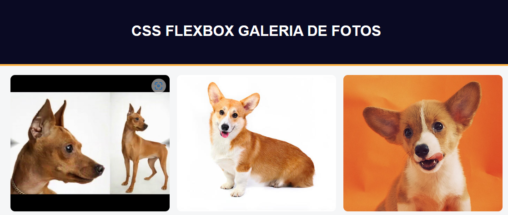

# Galeria de Fotos

Página simples HTML e CSS com uso do flexbox, para testar a responsividade do site.

## 🚀 Começando

Essas instruções permitirão que você obtenha uma cópia do projeto em operação na sua máquina local para fins de desenvolvimento e teste.

### ⌨️ Tela

## 📦 Website

<a href="https://rodrigonasciimento.github.io/galeria_fotos/">https://rodrigonasciimento.github.io/galeria_fotos/</a>

## 🛠️ Tecnologias e Ferramentas Utilizadas

* [HTML](http://www.dropwizard.io/1.0.2/docs/) - Linguagem de Marcação de HiperTexto
* [CSS](https://maven.apache.org/) - 
* [Visual Studio Code](https://rometools.github.io/rome/) - Usada para gerar RSS

## 🖇️ Repositório

<a href="https://github.com/rodrigonasciimento/galeria_fotos.git">https://github.com/rodrigonasciimento/galeria_fotos.git</a>

## ✒️ Autores

* **O desenvolvedor** - *Trabalho Inicial* - [o desenvolvedor](https://github.com/rodrigonasciimento)
